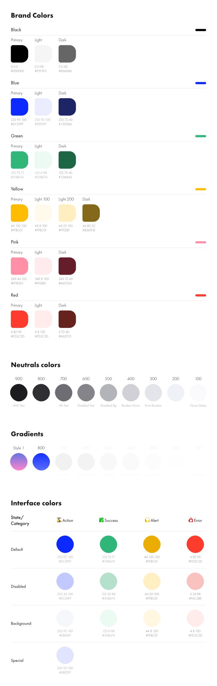
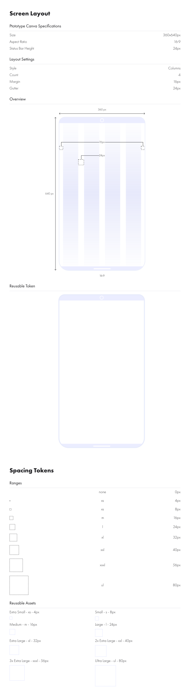
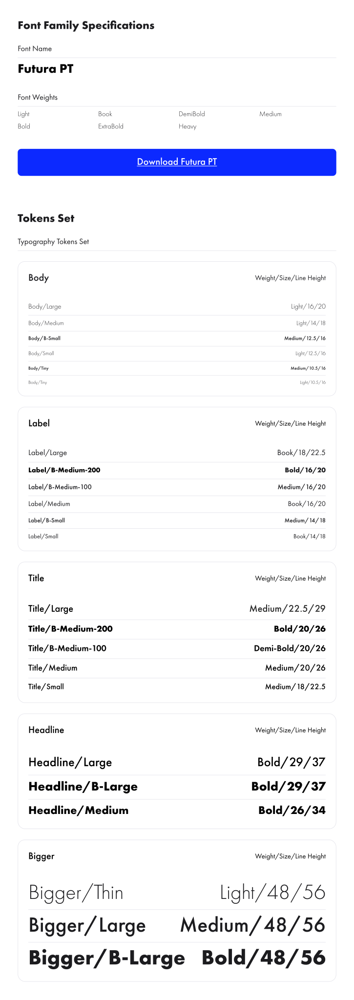

# Djamo App UI

A UI Design System (With Flutter) for Djamo.

# Design Tokens

## Colors

## Layout & Spacing

## Typography

## Iconography

# Core Components

## Controls
### Buttons
### Switchers
### Radio
## Views

